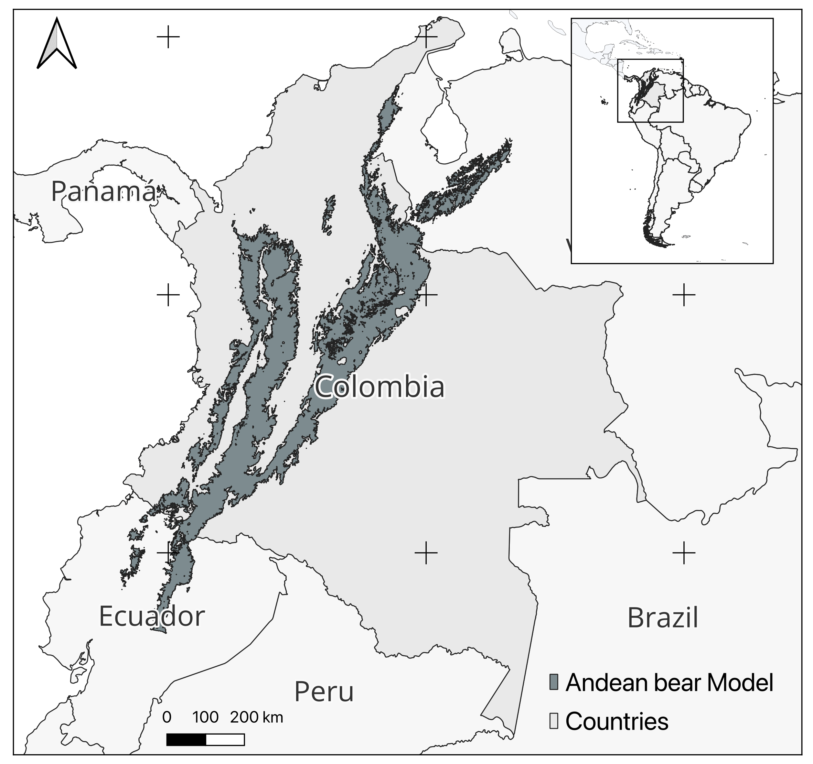

# Introduction

The spectacled bear (*Tremarctos ornatus*) was found in southern California and Central America, but after the Pleistocene, it was reduced to South America [@Paisley2006Activity; @Vela-Vargas2021Tremarctos] It is currently the only species of the family Ursidae in the Neotropics and its historical distribution included from the department of Mérida in Venezuela to southern Bolivia, in the department of Tarija, and possibly in some regions of northern Argentina [@Garcia-Rangel2012Andean; @Goldstein2006Andean].

Research on the spectacled bear has been conducted in Colombia since 1985. However, to date, knowledge about ecological aspects and the status of their populations is still approximate [@Kattan2004Range]. This species is threatened by the high rate of habitat transformation, which in the 1980s was 60,000 - and has probably increased due to the presence of illicit crops and human population growth in recent years [@Rodriguez2003Ecoregional]. Additionally, there has been an increase in bear-community conflict due to attacks on livestock and crop losses associated with the presence of bears, which may be due to the decrease in food supply in their natural habitat and the presence of livestock in and around their areas of use [@Kattan2004Range; @Sanchez-Mercado2008Factors].

Regarding conservation efforts, the formation of the Frontine Bear Specialist Group (GEOF) in 1983 gave rise to the Action Plan for the Conservation of the World's Bears by the IUCN. Based on this initiative, in Colombia, the Ministry of the Environment, together with several NGOs and regional autonomous corporations, participated in the formulation of the National Conservation Program for Tremarctos ornatus in 2001 and the Ecoregional Strategy for the Conservation of the Andean Bear in the Northern Andes in 2003. Likewise, work is currently being done on the Chingaza-Sumapaz-Guerrero Conservation Corridor initiative, which includes a large part of the species distribution in the departments of Cundinamarca and Meta [@Quintero2023Andean]. This corridor emerged as a strategy to achieve regional natural connectivity and to protect areas of water importance [@Quintero2023Andean] and in this sense, the inclusion of the bear as an umbrella species could help the conservation of the ecosystems of high mountains and water resources [@Kattan2004Range].

The main objective of this article was to evaluate the trend of change in habitat availability and elements of potential connectivity for the Spectacled Bear in Colombia in the last two decades and the role that PAs have played in its conservation. Likewise, the priority conservation units of the species related to its viability will be evaluated at the national level due to its potential to maintain a population, and key landscapes to ensure connectivity [@Kattan2004Range].

# Materials and Methods

## Species Distribution Model

The Potential Distribution Model available on the BioModelos Web portal (*www.biomodelos.org.co*) was used. BioModelos is a collaborative tool that created Species Distribution Models using mathematical methods and expert opinions [@Velasquez-Tibata2019Biomodelos] (Fig. 1). Likewise, information was collected in the communities surrounding the study area seeking to identify the sectors in which the spectacled bear has had direct or indirect contact with a man. The places of bear-community conflict will be georeferenced and located on the probability of presence maps, to infer how the conflicts are related to the probability of presence of the species.

## Identification of habitat coverage

A search was carried out in the literature of the covers that have been reported as bear habitat. The search was carried out mainly on the Web of Science and in Google Scholar, using the following keywords; Tremarctos ornatus, Andean bear, spectacled bear, Andean bear, spectacled bear, and habitat. Subsequently, the coverages found were validated based on coverages reported by experts, the IUCN, @Nowak1999Walker, @Hunt1998Ursidaea, and @Garshelis2009Family. The covers with at least one support from the sources mentioned above were taken as the covers with habitat for the species, thus selecting the covers of open forest, dense forest, riparian forest, grasslands, fragmented forest, secondary vegetation, and shrubs.

## Identification of habitat patches

To identify remaining habitat patches for the species in different periods, the national coverage layers available for the years 2002, 2012, and 2018 were taken. Subsequently, only the previously defined coverages were selected and the layer continued to be dissolved. to have a simpler one. With this, the cover layers were cut, for the different years, with the distribution model of the species, to obtain an approximation of the habitats occupied by the species. Finally, the areas were calculated, and only patches with sizes equal to or greater than 20 Km were selected.

# Results and discussion

It exists and is around in records reported in the last year to the species. Principally in the last 25 years (fig 2). This situation is probably because the use of the new technologies is more shipper than in another year and increased the use of tools to report the presence of the species. From the results obtained, the records of the species match with the ecosystems that have been reported in the bibliography, since the species is found in different ecosystems, among which dry areas stand out (in coastal sectors of Peru), areas of desert, and thorny chaparral to Páramos and cloud forests along the Andes mountain range @Kattan2004Range, @Garcia-Rangel2012Andean)

About the places in which the presence of the species was reported, in data portals Colombia was the country with the most records for this species (tale 1) To Colombia the was observed that these largely coincided with those present for Colombia, since in addition to inhabiting the three mountain ranges that cross the country, there are records that locate the species in the Sierra Nevada de Santa Marta, in the Serranía de Perijá @Solari2013Riqueza , in the Serranía de Baudó and the Macarena [@Vela-Vargas2021Tremarctos]

As for what was recorded by the model, the values obtained coincide with those recorded in other studies for the species, being evident in the important statistical robustness achieved with the study, despite not having had records for the species in its entire area [@MezaMori2020Predictive].

```{r echo=FALSE, out.width = "100%", fig.align = "center", fig.cap="Potentianl distribution to the Andean Bear in the North of the Andes"}

#,
                          #caption = "\\label{fig1} Potencial Distribution to the *Tremactus ornatus* in the north to the Andes."
#)
```

```{r theme_ggplot2, echo = FALSE, message = FALSE, fig.cap=" Records to the Andean bear in the las 25 years" }

library(hrbrthemes)
library(tidyverse)

dt <- read.csv(file = '../rawData/BM_all_data2.csv')

year <- as.data.frame(table(dt$year))
  

tail(year,25) %>%
  ggplot( aes(x=Var1, y=Freq, group =1)) +
  geom_line(color="dodgerblue1") +
  labs(y= "number of records", x = "Years") +
  theme(axis.text.x = element_text(angle=-45, vjust=.5, hjust=1))

```

```{r tab1, echo = FALSE, out.width = "200%", fig.align = "center"}
tb <-  as.data.frame (table(dt$country))
names(tb) <- c('Countries', 'Frecuency')
knitr::kable(
    tb, 
    caption = "\\label{tab1}Records by countriess"
)

```
